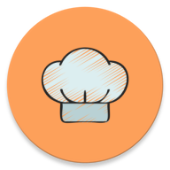

<p align="center">
  
</p>

<h1 align="center">Foodo — Meal Planner & Recipe Manager</h1>

<p align="center">
  <b>Plan your meals, explore recipes, manage ingredients, and cook with confidence.</b>
</p>

<p align="center">
  
  
  
  
  
  
</p>

---

## Table of Contents

- [About](#about)
- [Features](#features)
- [Screenshots](#screenshots)
- [Architecture](#architecture)
- [Tech Stack](#tech-stack)
- [Project Structure](#project-structure)
- [Getting Started](#getting-started)
- [API Reference](#api-reference)
- [Database Schema](#database-schema)
- [Contributing](#contributing)
- [License](#license)

---

## About

**Foodo** is a feature-rich Android meal planner and recipe management application built with Java. It allows users to discover new recipes from around the world, plan meals for specific dates, save favorite dishes, and build an ingredient shopping cart — all in one place.

Whether you're a home cook looking for inspiration or someone who wants to organize weekly meals, Foodo provides an intuitive and beautiful experience powered by [TheMealDB](https://www.themealdb.com/) API.

---

## Features

### Discovery & Search
- **Meal of the Day** — Get inspired with a random meal suggestion on the home screen
- **Browse by Category** — Explore meals organized by categories (Beef, Chicken, Dessert, etc.)
- **Browse by Country** — Discover cuisines from different regions around the world
- **Search by Name** — Quickly find any meal by its name
- **Search by Ingredient** — Have specific ingredients? Find meals that use them

### Recipe Details
- **Full Recipes** — View complete meal details including ingredients, measurements, and step-by-step cooking instructions
- **Embedded Video** — Watch YouTube cooking tutorials directly within the app
- **Ingredient Images** — Visual reference for every ingredient in the recipe

### Meal Planning
- **Date-based Planner** — Schedule meals for any day using a date picker
- **Weekly Overview** — View and manage your planned meals organized by date
- **Cloud Sync** — Planned meals sync across devices via Firebase Firestore

### Favorites
- **Save Favorites** — Bookmark meals you love with a single tap
- **Cloud Backup** — Favorites are synced to Firebase Firestore so you never lose them
- **Offline Access** — Favorited meals are cached locally for offline viewing

### Ingredient Cart
- **Smart Cart** — Add all ingredients from a recipe to your shopping cart with one tap
- **Manage Quantities** — Track ingredient quantities and measurements
- **Shopping List** — Use the cart as a shopping list when heading to the store

### Authentication
- **Email & Password** — Traditional sign-up with email verification
- **Google Sign-In** — Quick authentication using Google accounts
- **Facebook Login** — Sign in with Facebook credentials
- **Guest Mode** — Browse the app anonymously without creating an account

### User Experience
- **Onboarding Flow** — Beautiful introduction screens for first-time users
- **Shimmer Loading** — Elegant loading placeholders while content fetches
- **Lottie Animations** — Smooth, delightful animations throughout the app
- **Offline Support** — Cached data available when there's no internet connection
- **Material Design** — Modern UI following Google's Material Design guidelines

---
<!--
## Screenshots

> *Screenshots coming soon — contributions welcome!*
-->

<!--
Add screenshots to a `/screenshots` folder and reference them like this:

| Home | Search | Meal Details |
|:----:|:------:|:------------:|
|  |  |  |

| Planner | Favorites | Cart |
|:-------:|:---------:|:----:|
|  |  |  |
-->

---

## Architecture

Foodo follows the **MVP (Model–View–Presenter)** architecture pattern, ensuring a clean separation of concerns:

```
┌─────────────────────────────────────────────────────────────┐
│                        VIEW (Fragment)                      │
│              Displays data, handles user input              │
└────────────────────────────┬────────────────────────────────┘
                             │ Contract Interface
┌────────────────────────────▼────────────────────────────────┐
│                      PRESENTER                              │
│          Business logic, mediates View ↔ Model              │
└────────────────────────────┬────────────────────────────────┘
                             │
┌────────────────────────────▼────────────────────────────────┐
│                    MODEL (Repository)                       │
│         Data access: API + Room DB + Firebase               │
└──────┬──────────────────┬──────────────────┬────────────────┘
       │                  │                  │
  ┌────▼─────┐      ┌─────▼─────┐     ┌─────▼──────┐
  │ Retrofit │      │  Room DB  │     │  Firebase  │
  │  (API)   │      │ (Local)   │     │ (Auth/Sync)│
  └──────────┘      └───────────┘     └────────────┘
```

### Data Flow

1. **View** receives user events and delegates to **Presenter**
2. **Presenter** calls **Repository** methods to fetch/modify data
3. **Repository** coordinates between remote (API), local (Room), and cloud (Firestore) data sources
4. Results flow back through callbacks/RxJava to the **View** for display

---

## Tech Stack

| Layer | Technology |
|-------|------------|
| **Language** | Java 11 |
| **UI Framework** | Android SDK, Material Components, ConstraintLayout |
| **Architecture** | MVP with Contract interfaces |
| **Networking** | Retrofit 3.0.0, Gson Converter |
| **Reactive** | RxJava 3.1.5, RxAndroid 3.0.2 |
| **Local Database** | Room 2.8.4 (with RxJava3 support) |
| **Authentication** | Firebase Auth (Email, Google, Facebook, Anonymous) |
| **Cloud Storage** | Firebase Firestore |
| **Image Loading** | Glide 5.0.5 |
| **Video Player** | android-youtube-player 13.0.0 |
| **Navigation** | Jetpack Navigation Component 2.9.7 |
| **Animations** | Lottie 6.7.1, Facebook Shimmer 0.5.0 |
| **View Binding** | Enabled |
| **Onboarding** | ViewPager2 + DotsIndicator |
| **Toasts** | MotionToast |

---

## Project Structure

```
app/src/main/java/iti/student/foodo/
│
├── core/                          # Core utilities and base classes
│   ├── base/                      # BasePresenter, BaseView interfaces
│   ├── network/                   # ApiClient, ApiService, NetworkConstants
│   └── utils/                     # Common utilities
│
├── data/                          # Data layer
│   ├── datasource/
│   │   ├── local/                 # Room DAOs, PrefManager
│   │   └── remote/                # MealsRemoteDataSource
│   ├── db/                        # AppDatabase (Room)
│   ├── mapper/                    # Data ↔ Entity mappers
│   ├── models/                    # API response models
│   ├── network/
│   │   ├── firebase/              # AuthService, FirestoreService
│   │   └── retrofit/              # ApiService interface
│   └── repository/                # Repository implementations
│       ├── auth/                  # AuthRepository
│       ├── cart/                  # CartRepository
│       ├── favorite/              # FavoriteRepository
│       ├── meal/                  # MealRepository
│       └── planner/               # PlannerRepository
│
└── features/                      # Feature modules
    ├── splash/                    # Splash screen
    ├── onboarding/                # Onboarding screens
    ├── auth/
    │   ├── login/                 # Login (view + presenter)
    │   ├── register/              # Registration (view + presenter)
    │   └── forgetpassword/        # Password reset
    ├── home/                      # Home (view + presenter)
    ├── search/                    # Search (view + presenter)
    ├── meal/                      # Meal details (view + presenter)
    ├── favorites/                 # Favorites (view + presenter)
    ├── planner/                   # Meal planner (view + presenter)
    ├── cart/                      # Shopping cart (view + presenter)
    └── utils/                     # Shared UI components
        ├── ErrorDialog            # Error dialog
        ├── ConfirmDialog          # Confirmation dialog
        ├── MyDatePicker           # Date picker utility
        ├── BlurUtils              # Background blur effect
        ├── ValidationUtils        # Input validation
        └── VideoUtils             # YouTube video helpers
```

---

## Getting Started

### Prerequisites

- **Android Studio** Ladybug (2024.2.1) or later
- **JDK 11** or higher
- **Android SDK** with API level 36
- A **Firebase** project (for authentication and cloud sync)

### Installation

1. **Clone the repository**

   ```bash
   git clone https://github.com/your-username/Foodo.git
   cd Foodo
   ```

2. **Set up Firebase**

   - Go to the [Firebase Console](https://console.firebase.google.com/)
   - Create a new project (or use an existing one)
   - Add an Android app with the package name `iti.student.foodo`
   - Download `google-services.json` and place it in the `app/` directory
   - Enable the following authentication providers:
     - Email/Password
     - Google
     - Facebook (optional)
     - Anonymous

3. **Configure Firestore**

   - In Firebase Console, go to **Firestore Database**
   - Create a database in production or test mode
   - The app will automatically create the required collections:
     - `users/{uid}/favorites`
     - `users/{uid}/plannedMeals`

4. **Build and Run**

   - Open the project in Android Studio
   - Sync Gradle files
   - Connect a device or start an emulator (API 24+)
   - Click **Run** ▶️

### Configuration

No additional API keys are required — Foodo uses the free tier of [TheMealDB API](https://www.themealdb.com/api.php).

---

## API Reference

Foodo fetches all meal data from [TheMealDB](https://www.themealdb.com/api.php) — a free, open-source API for recipes.

| Endpoint | Description |
|----------|-------------|
| `search.php?s={name}` | Search meals by name |
| `lookup.php?i={id}` | Get full meal details by ID |
| `random.php` | Get a random meal |
| `filter.php?c={category}` | Filter meals by category |
| `filter.php?a={area}` | Filter meals by country/area |
| `filter.php?i={ingredient}` | Filter meals by main ingredient |
| `categories.php` | List all meal categories |
| `list.php?a=list` | List all areas/countries |
| `list.php?i=list` | List all ingredients |

**Base URL:** `https://www.themealdb.com/api/json/v1/1/`

---

## Database Schema

Foodo uses **Room** for local persistence with the following entities:

| Entity | Description |
|--------|-------------|
| `MealEntity` | Cached meal data from API |
| `IngredientEntity` | Ingredients for each meal |
| `InstructionEntity` | Step-by-step cooking instructions |
| `FavoriteMealEntity` | User's favorite meals |
| `PlannedMealEntity` | Meals planned for specific dates |
| `CartIngredientEntity` | Ingredients added to the shopping cart |
| `UserEntity` | Authenticated user profile |

### Sync Strategy

| Data Type | Local (Room) | Cloud (Firestore) |
|-----------|:------------:|:-----------------:|
| Meals cache | ✅ | — |
| Favorites | ✅ | ✅ |
| Planned meals | ✅ | ✅ |
| Cart | ✅ | — |

---

## Navigation Flow

```
Splash
  ├── First Launch → Onboarding → Auth (Login/Register)
  ├── Not Signed In → Auth (Login/Register)
  └── Signed In → Main App
                      │
                      ├── 🏠 Home
                      │     ├── Meal of the Day
                      │     ├── Categories → Meals List
                      │     └── Popular Meals
                      │
                      ├── 🔍 Search
                      │     ├── By Name
                      │     ├── By Category
                      │     ├── By Country
                      │     └── By Ingredient
                      │
                      ├── 📅 Planner
                      │     └── Scheduled meals by date
                      │
                      ├── ❤️ Favorites
                      │     └── Saved meals list
                      │
                      └── 🛒 Cart
                            └── Ingredient shopping list

      All sections → Meal Details (Recipe, Video, Ingredients, Instructions)
```

---

## Contributing

Contributions are welcome! Here's how you can help:

1. **Fork** the repository
2. **Create** a feature branch (`git checkout -b feature/amazing-feature`)
3. **Commit** your changes (`git commit -m 'Add amazing feature'`)
4. **Push** to the branch (`git push origin feature/amazing-feature`)
5. **Open** a Pull Request

### Guidelines

- Follow the existing MVP architecture pattern
- Write clean, documented Java code
- Test on API 24+ devices before submitting
- Keep UI consistent with Material Design guidelines

---

## License

This project is licensed under the MIT License — see the [LICENSE](LICENSE) file for details.

---

## Acknowledgments

- [TheMealDB](https://www.themealdb.com/) — Free meal recipe API
- [Firebase](https://firebase.google.com/) — Authentication and cloud storage
- [Lottie](https://airbnb.io/lottie/) — Beautiful animations
- [Glide](https://bumptech.github.io/glide/) — Efficient image loading
- [android-youtube-player](https://github.com/PierfrancescoSofworthy/android-youtube-player) — YouTube video integration

---

<p align="center">
  Made with ❤️ by the Foodo Team — ITI
</p>
